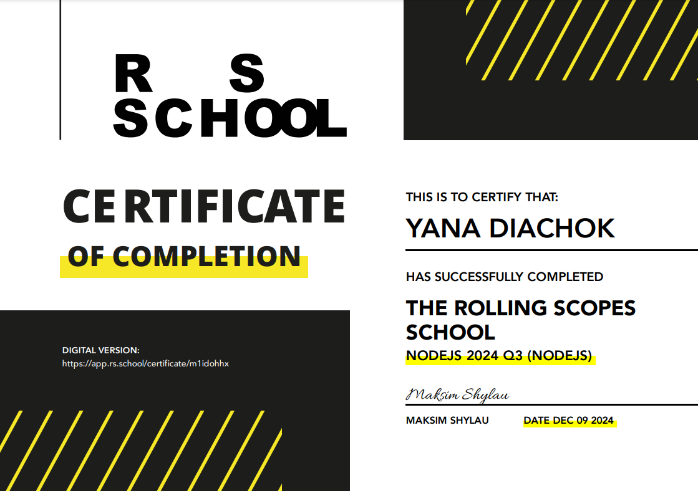
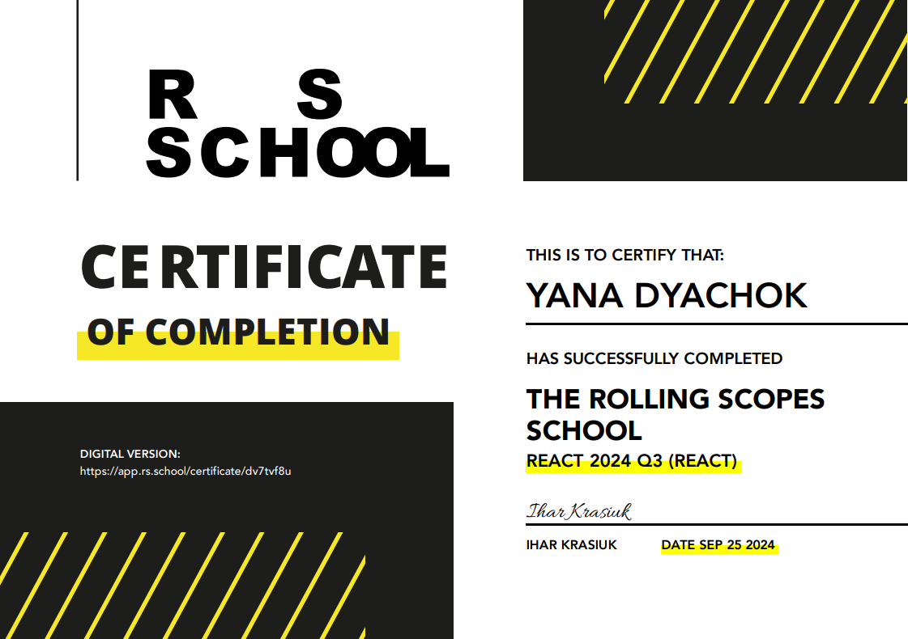
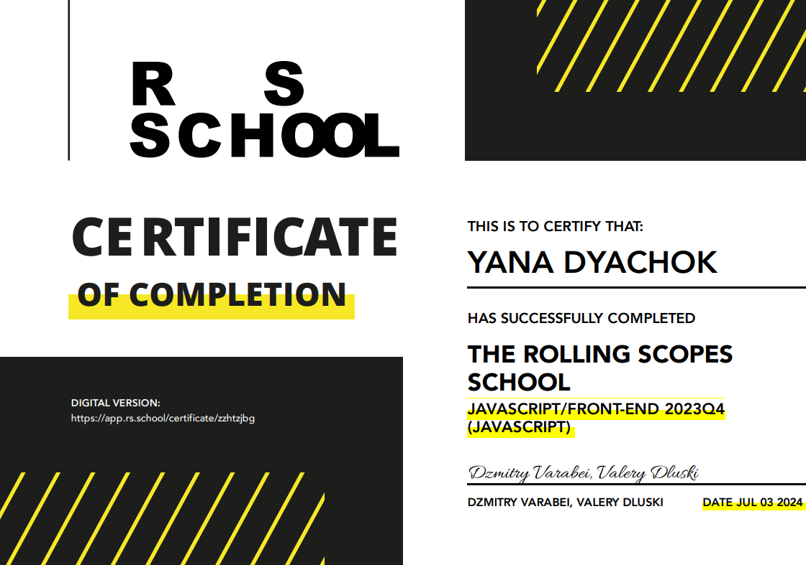
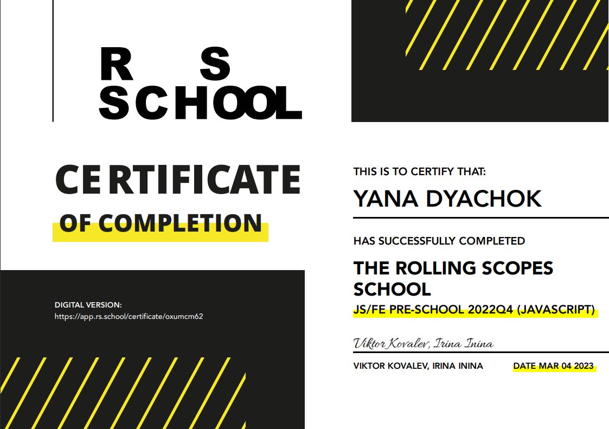
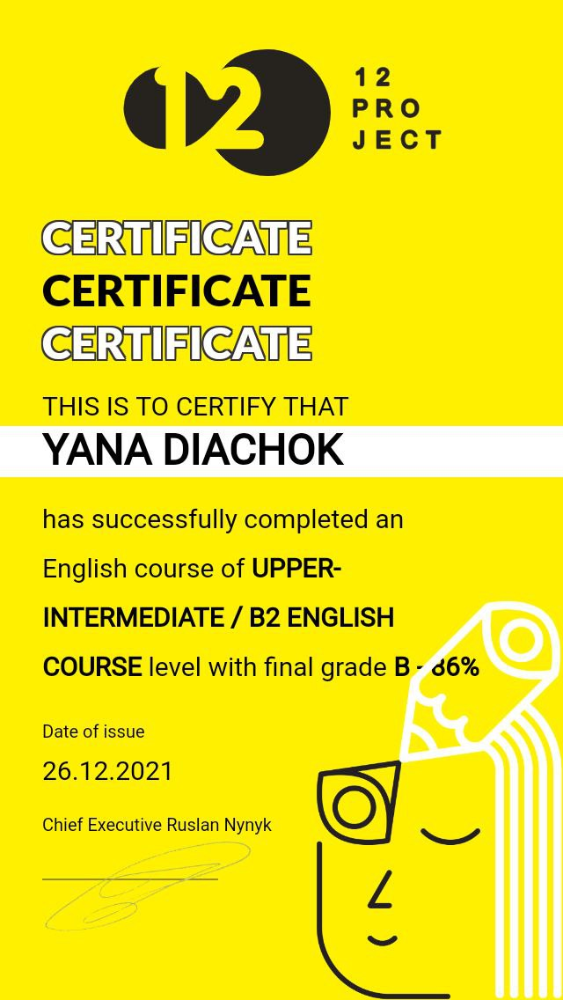

### 👋 Hi, I’m Yana

## About myself  ([CV](https://diachok-yana-cv.netlify.app/))
-  👀 I’m interested in front-end development
- My qualities: learn quickly, self-taught, goal-oriented, polite, organized, team-player, hard-working

### Contacts
              

### Skills
                    

    

## 👩‍💻 My Projects 

 Tasks                    |       Links to repositories  | Deploy links 
--------------------------|:-------------------------------|:-----------------------:                                        | 
[The-Car-Dealer-App](https://develops.notion.site/Front-end-JS-engineer-test-assessment-the-Recipe-Finder-App-5b87f1603ac54112bacfdc625a85a87b)|[The-Car-Dealer-App](https://github.com/Yana-Dyachok/The-Car-Dealer-App?tab=readme-ov-file)|[The-Car-Dealer-App](https://the-car-dealer-app-ten.vercel.app/)
[Async-Race-React ](https://github.com/rolling-scopes-school/tasks/tree/master/stage2/tasks/async-race)| [Async-Race-React](https://github.com/Yana-Dyachok/Async-Race-React/tree/develop?tab=readme-ov-file)|[Async-Race-React](https://async-race-react-diachok.netlify.app/?page=1)
[REST/GraphiQL Client](https://github.com/rolling-scopes-school/tasks/blob/master/react/modules/tasks/final.md)| [REST/GraphiQL Client](https://github.com/Yana-Dyachok/rest-graphiql-app?tab=readme-ov-file)|[REST/GraphiQL Client](https://graphiql-app-undefineds-rss.vercel.app/)
[React. Redux. Context api](https://github.com/rolling-scopes-school/tasks/blob/master/react/modules/tasks/redux.md) |[React. Redux. Context api](https://github.com/Yana-Dyachok/React-2024Q3/tree/app-state-management)| [React. Redux. Context api](https://yana-dyachok.github.io/React-2024Q3/)
[React Forms](https://github.com/rolling-scopes-school/tasks/blob/master/react/modules/tasks/forms.md)| [React Forms](https://github.com/Yana-Dyachok/React-2024Q3/tree/forms) | [React Forms](https://react-dyachok.netlify.app/)
[eCommerce-Application](https://github.com/rolling-scopes-school/tasks/tree/master/tasks/eCommerce-Application) | [eCommerce-Application](https://github.com/Yana-Dyachok/eCommerce-Application)| [eCommerce-Application](https://undefined-shop.vercel.app/)
[Fun Chat](https://github.com/rolling-scopes-school/tasks/blob/master/stage2/tasks/fun-chat/README.md) |[Fun Chat](https://github.com/Yana-Dyachok/JS-FE-2023Q4/tree/fun-chat) | [Fun Chat](https://yana-dyachok.github.io/JS-FE-2023Q4/fun-chat/)
[RSS Puzzle](https://github.com/rolling-scopes-school/tasks/tree/master/stage2/tasks/puzzle)                                                        | [RSS Puzzle](https://github.com/Yana-Dyachok/JS-FE-2023Q4/tree/rss_puzzle)      | [RSS Puzzle](https://yana-dyachok.github.io/JS-FE-2023Q4/rss-puzzle/)
[News API](https://github.com/rolling-scopes-school/tasks/blob/master/tasks/migration-newip-to-ts.md) |[News API](https://github.com/Yana-Dyachok/JS-FE-2023Q4/tree/news-api?tab=readme-ov-file)|[News API](https://yana-dyachok.github.io/JS-FE-2023Q4/news-api/)
[Nonograms](https://github.com/rolling-scopes-school/tasks/tree/master/tasks/nonograms)  |[Nonograms](https://github.com/Yana-Dyachok/JS-FE-2023Q4/tree/nonograms?tab=readme-ov-file)|[Nonograms](https://yana-dyachok.github.io/JS-FE-2023Q4/nonograms/)
[Minesweeper](https://github.com/rolling-scopes-school/tasks/blob/master/tasks/minesweeper/README.md) |[Minesweeper](https://github.com/Yana-Dyachok/minesweeper/tree/main?tab=readme-ov-file) |[Minesweeper](https://yana-dyachok.github.io/minesweeper/)
[Plants](https://github.com/rolling-scopes-school/tasks/blob/master/tasks/plants/plants.md)                                  | [Plants](https://github.com/Yana-Dyachok/plants)       |   [Plants](https://yana-dyachok.github.io/plants/)
[Momentum ](https://github.com/rolling-scopes-school/tasks/blob/master/tasks/momentum/momentum-stage1.md)                    | [Momentum ](https://github.com/Yana-Dyachok/momentum)      |   [Momentum](https://yana-dyachok.github.io/momentum/src/index.html)
[Hangman](https://github.com/rolling-scopes-school/tasks/tree/master/stage1/tasks/hangman)                                   |  [Hangman](https://github.com/Yana-Dyachok/hangman)     |   [Hangman](https://yana-dyachok.github.io/hangman/hangman/index.html)
[Coffee house](https://github.com/rolling-scopes-school/tasks/blob/master/tasks/coffee-house/coffee-house-week1.md)          | [Coffee house](https://github.com/Yana-Dyachok/coffee-house)  | [Coffee house](https://yana-dyachok.github.io/coffee-house/coffee-house/)
[Virtual keyboard](https://github.com/rolling-scopes-school/tasks/blob/master/tasks/virtual-keyboard/virtual-keyboard-en.md) | [Virtual keyboard](https://github.com/Yana-Dyachok/virtual-keyboard) | [Virtual keyboard](https://yana-dyachok.github.io/virtual-keyboard/keyboard/src/)
Sticks game - myself                                     |   [Sticks game](https://github.com/Yana-Dyachok/sticks-game?tab=readme-ov-file)| [Sticks game](https://yana-dyachok.github.io/sticks-game/sticks-game/) 
To-do list - myself | [To-do list](https://github.com/Yana-Dyachok/todo-list)| [To-do list](https://yana-dyachok.github.io/todo-list/todo-list/)
[CssBayan](https://github.com/DrDiman/CSS-Bayan-task)                                                                        | [CssBayan](https://github.com/Yana-Dyachok/cssBayan)  |[CssBayan](https://yana-dyachok.github.io/cssBayan/cssBayan/index.html)
Workday check-myself                                                     | [Workday check](https://github.com/Yana-Dyachok/workday-check)  |[Workday check](https://yana-dyachok.github.io/workday-check/)
[Shelter](https://github.com/rolling-scopes-school/tasks/blob/master/tasks/shelter/shelter.md)                               | [Shelter](https://github.com/Yana-Dyachok/shelter?tab=readme-ov-file)  |[Shelter](https://yana-dyachok.github.io/shelter/main/index.html)
Password - myself                                             |  [Password](https://github.com/Yana-Dyachok/password?tab=readme-ov-file) |[Password validator](https://yana-dyachok.github.io/password/)

### Games and tasks using C++
 Titles                          |   Links to the repositories
---------------------------------|:-----------------------:
Vectors.OOP                      |   [Vectors.OOP](https://github.com/Yana-Dyachok/Vectors.OOP)
Rock-Paper-Scissors-Lizard-Spock |   [Rock-Paper-Scissors-Lizard-Spock](https://github.com/Yana-Dyachok/Rock-Paper-Scissors-Lizard-Spock)
Choose-Optimal-Distance          |   [Choose-Optimal-Distance](https://github.com/Yana-Dyachok/Choose-Optimal-Distance)
Battleship-game                  |   [Battleship-game](https://github.com/Yana-Dyachok/Battleship-game)

### 🎓 Certificates:
 ####  
 📜<a href="https://app.rs.school/certificate/m1idohhx" target="_blank">Node.js</a>
 ####  
 📜<a href="https://app.rs.school/certificate/qwbdssph" target="_blank">React</a>
 #### 
 📜 <a href="https://app.rs.school/certificate/ya9as3wp" target="_blank">JavaScript/Front-end</a>
 #### 
 📜<a href="https://app.rs.school/certificate/oxumcm62" target="_blank">JS/FE Pre-School</a>
 #### 
